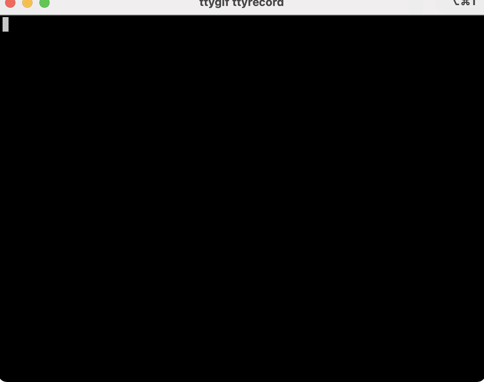

# tslib-tpl

> 一个开发 typescript 库的命令行工具

<div align="center">

[English](./README.md) | 简体中文

</div>

## 安装

```bash
npm install -g @zfitness/tslib-tpl
```

## 初始化

先 cd 到你需要初始化的项目目录，执行以下命令

```bash
tslib-tpl init
```


