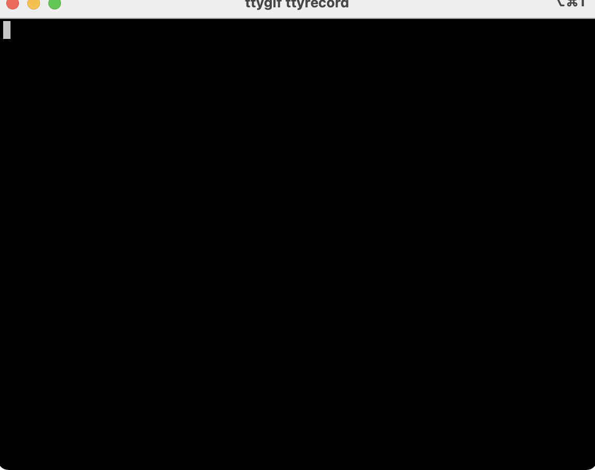

# tslib-tpl

> A command line tool for developing typescript libraries.

<div align="center">

English | [简体中文](./README-zh_CN.md)

</div>

## install

```bash
npm install -g @zfitness/tslib-tpl
```

## init

```bash
tslib-tpl init
```


